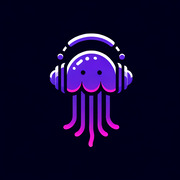
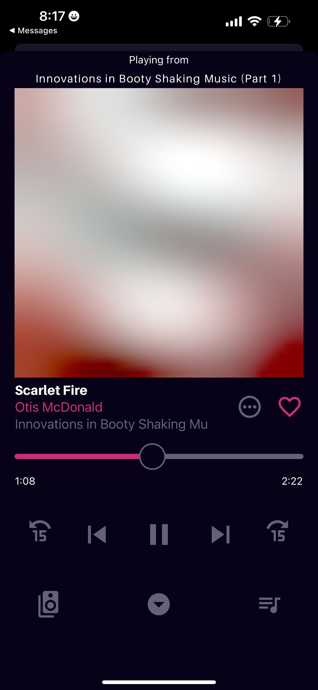

# Jellify (verb) - to make gelatinous


A music player for [Jellyfin](https://jellyfin.org/) built with [React Native](https://reactnative.dev/). 

### Background
I wanted to create a music app that could handle extremely large music libraries (i.e., 100K+ songs) and not get bogged down. I wanted to avoid syncing the database to the device when the library changes, and instead opt for a heavily cached persistence layer instead. I discovered Tanstack Query and combined it with React Native MMKV and the rest was history!

This app was designed with me and my dad in mind, since I wanted to give him a sleek, one stop shop for live recordings of bands he likes (read: the Grateful Dead), with a UI that he'd find instantly familiar and useful. CarPlay / Android Auto support is also a must for him.

Designed to be lightweight and scalable, *Jellify* caters to those who want a music player experience similar to what's provided by music streaming services. 

## Features
### Current
- Available via Private Testflight
- Home screen access to previously played tracks, artists, and your playlists
- Full Last.FM Plugin support
- Library of Favorited Music, not too dissimilar to how streaming services handle your 'library'

### Roadmap
- Full playlist support, including creating, updating, and reordering
- Quick access to similar artists and items for discovering music in your library
- Support for Jellyfin mixes
- CarPlay / Android Auto Support
- Public Testflight
- Offline Playback

## Lemme see!
### Home


### Favorites / Library


### Player



## Built with:
### Frontend
[Tamagui](https://tamagui.dev/)\
[React Navigation](https://reactnavigation.org/)\
[React Native Vector Icons](https://github.com/oblador/react-native-vector-icons)
- Specifically Material Community Icons

[React Native CarPlay](https://github.com/birkir/react-native-carplay)\
[React Native Blurhash](https://github.com/mrousavy/react-native-blurhash)

### Backend
[Jellyfin SDK](https://typescript-sdk.jellyfin.org/)\
[Tanstack Query](https://tanstack.com/query/latest/docs/framework/react/react-native)\
[React Native Track Player](https://github.com/doublesymmetry/react-native-track-player)\
[React Native MMKV](https://github.com/mrousavy/react-native-mmkv)

### Love from Wisconsin 🧀
This is undoubtedly a passion project of [mine](https://github.com/anultravioletaurora), and I've learned a lot from working on it (and the many failed attempts before it). I hope you enjoy using it! Feature requests and bug reports are welcome :)

## Special Thanks To
- The [Jellyfin Team](https://jellyfin.org/) for their amazing server software
- Tony, Alyssa for their contributions

## Running Locally
Clone the repository and run ```npm i``` to install the dependencies