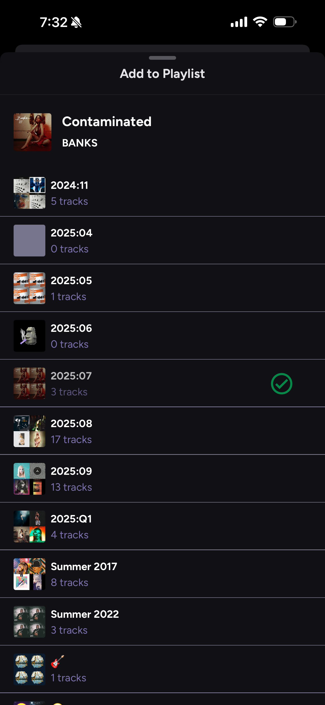
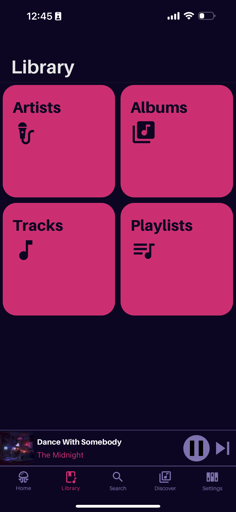
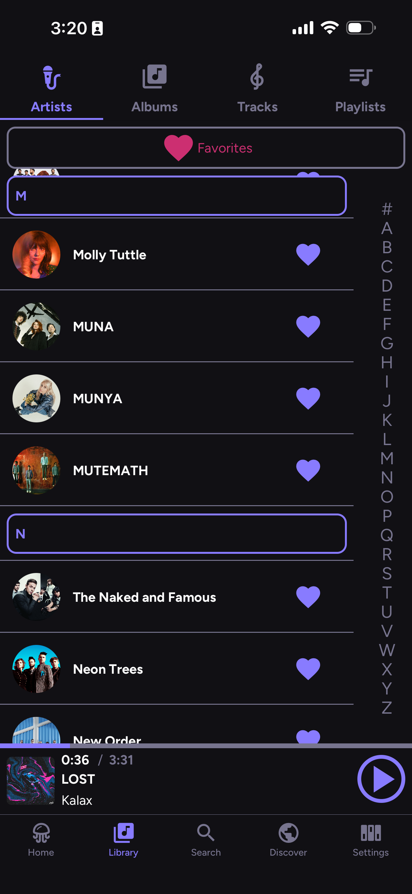
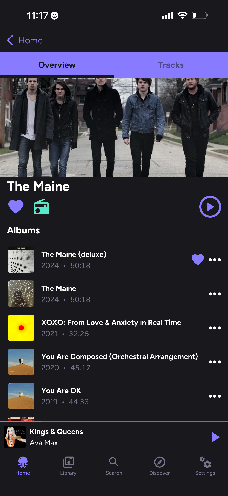
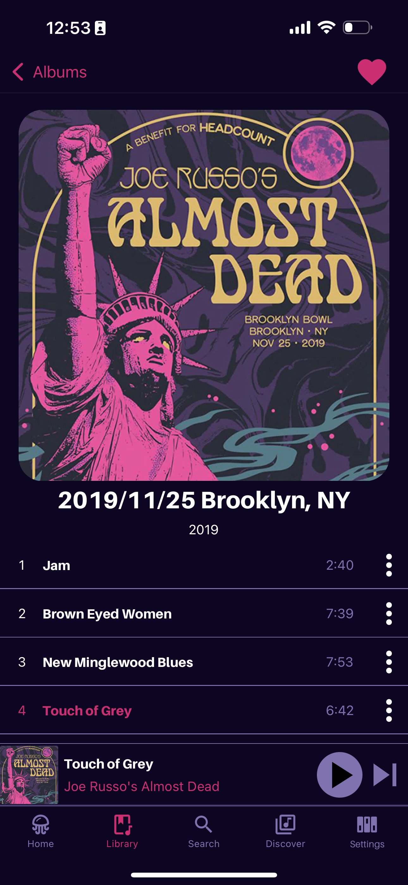
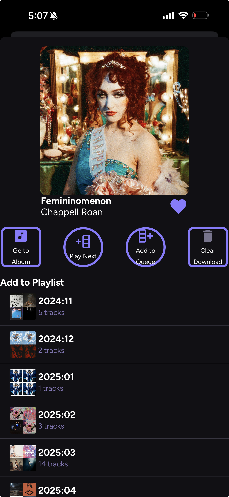
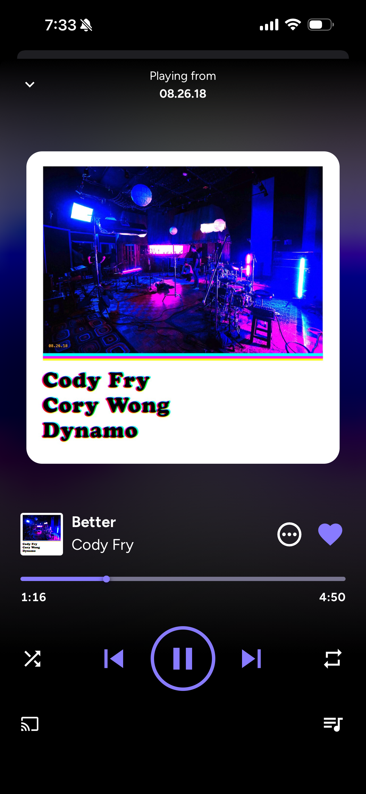
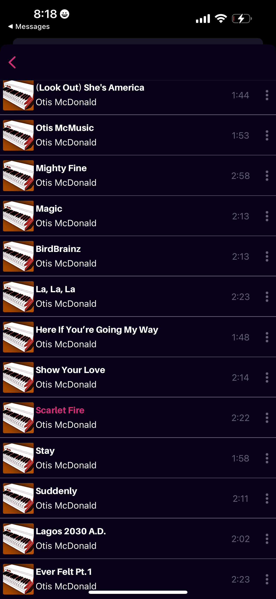

# 🪼 Jellify

> **jellify** (verb) - *to make gelatinous*  
[see also](https://www.merriam-webster.com/dictionary/jellify)

*Jellify* is a free and open source music player for [Jellyfin](https://jellyfin.org/). Built with [React Native](https://reactnative.dev/), *Jellify* provides a user experience that feels familar to other popular music apps and a has featureset to match

> *Jellify* requires a connection to a [Jellyfin](https://jellyfin.org/) server to work.

### 🤓 Background
I was after a music app for Jellyfin that showcased my music with artwork, had a user interface congruent with what the big guys do, and had the ability to algorithmically curate music (not that you have to use *Jellify* that way). I also wanted to create a music app that could handle my extremely large music libraries (i.e., 100K+ songs) and not get bogged down. 

This app was designed with me and my dad in mind, since I wanted to give him a sleek, one stop shop for live recordings of bands he likes (read: the Grateful Dead). The UI was designed so that he'd find it instantly familiar and useful. CarPlay / Android Auto support was also a must for us, as we both use CarPlay religiously. 

**TL;DR** Designed to be lightweight and scalable, *Jellify* caters to those who want a mobile Jellyfin music experience similar to what's provided by the big music streaming services. 

## 💡 Features
### ✨ Current
- Available via Private Testflight
- iOS support
- Light and Dark modes
- Home screen access to previously played tracks, artists, and your playlists
- Jellyfin playback reporting and [Last.FM Plugin](https://github.com/jesseward/jellyfin-plugin-lastfm) support
- Library of Favorited Music, not too dissimilar to how streaming services handle your 'library'
- Full playlist support, including creating, updating, and reordering

### 🛠 Roadmap
- [Android Support](https://github.com/anultravioletaurora/Jellify/issues/54)
- Quick access to similar artists and items for discovering music in your library
- [Support for Jellyfin Instant Mixes](https://github.com/anultravioletaurora/Jellify/issues/50)
- [CarPlay / Android Auto Support](https://github.com/anultravioletaurora/Jellify/issues/5)
- Public Testflight
- [Offline Playback](https://github.com/anultravioletaurora/Jellify/issues/10)
- Shared, Public, and Collaborative Playlists
- Web / Desktop support

## 👀 Lemme see!
### Home
Home

### Library
Library

Library Artists

Artist

Album

Track Options
 

Playlist

### Search

### Player

### CarPlay (Sneak Preview)

### On the Server

## 🏗 Built with:
### 🎨 Frontend
[Tamagui](https://tamagui.dev/)\
[React Navigation](https://reactnavigation.org/)\
[React Native Vector Icons](https://github.com/oblador/react-native-vector-icons)
- Specifically Material Community Icons

[React Native CarPlay](https://github.com/birkir/react-native-carplay)\
[React Native Blurhash](https://github.com/mrousavy/react-native-blurhash)

### 🎛️ Backend
[Jellyfin SDK](https://typescript-sdk.jellyfin.org/)\
[Tanstack Query](https://tanstack.com/query/latest/docs/framework/react/react-native)\
[React Native Track Player](https://github.com/doublesymmetry/react-native-track-player)\
[React Native MMKV](https://github.com/mrousavy/react-native-mmkv)\
[React Native File Access](https://github.com/alpha0010/react-native-file-access)

### 👩‍💻 Monitoring
[GlitchTip](https://glitchtip.com/)

### 💜 Love from Wisconsin 🧀
This is undoubtedly a passion project of [mine](https://github.com/anultravioletaurora), and I've learned a lot from working on it (and the many failed attempts before it). I hope you enjoy using it! Feature requests and bug reports are welcome :)

## 🙏 Special Thanks To
- The [Jellyfin Team](https://jellyfin.org/) for their amazing server software, SDKs, and documentation
- All contributors of [Finamp](https://github.com/jmshrv/finamp). *Jellify* draws inspiration and wisdom from it, and is another fantastic music app for Jellyfin
- The folks in the [Margelo Community Discord](https://discord.com/invite/6CSHz2qAvA) for their assistance
- Tony, Trevor, [Laine](https://github.com/lainie-ftw) and [Jordan](https://github.com/jordanbleu) for their testing and feedback from the early stages of development
- [Alyssa](https://www.instagram.com/uhh.lyssarae?igsh=MTRmczExempnbjBwZw==), for your design knowledge and for making the artwork for *Jellify*. You’ve been instrumental in shaping it’s user experience
