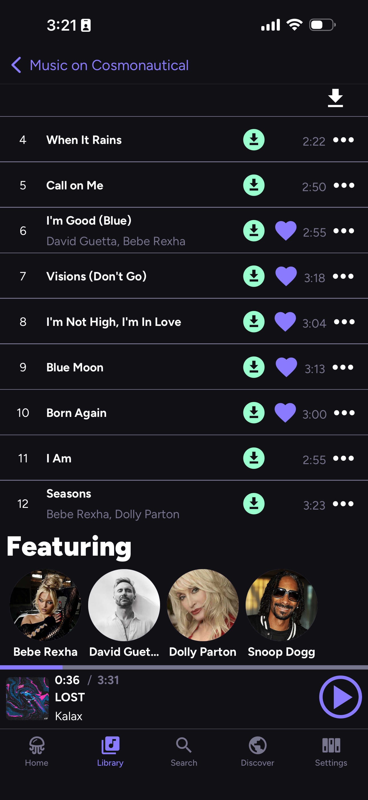
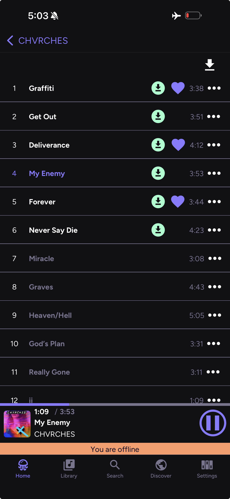
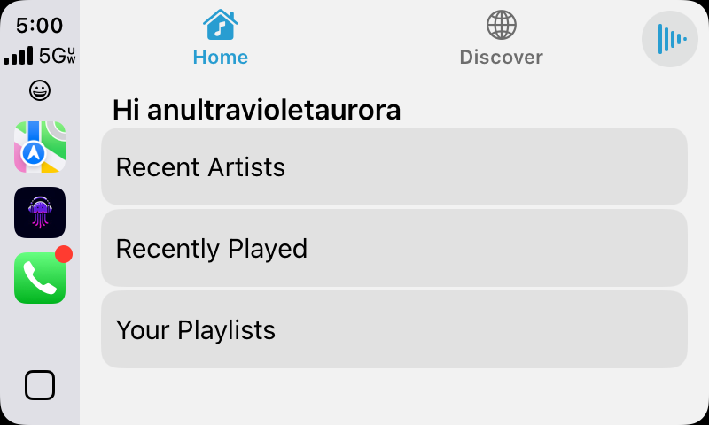

# 🪼 Jellify

 

## 🔗 Quick Links

[TestFlight](https://testflight.apple.com/join/etVSc7ZQ)

## ℹ️ About

> **jellify** (verb) - _to make gelatinous_  
> [see also](https://www.merriam-webster.com/dictionary/jellify)

_Jellify_ is a free and open source music player for [Jellyfin](https://jellyfin.org/). Built with [React Native](https://reactnative.dev/), _Jellify_ provides a user experience that feels familar to other popular music apps and a has featureset to match

> _Jellify_ requires a connection to a [Jellyfin](https://jellyfin.org/) server to work.

### 🤓 Background

I was after a music app for Jellyfin that showcased my music with artwork, had a user interface congruent with what the big guys do, and had the ability to algorithmically curate music (not that you have to use _Jellify_ that way). I also wanted to create a music app that could handle my extremely large music libraries (i.e., 100K+ songs) and not get bogged down.

This app was designed with me and my dad in mind, since I wanted to give him a sleek, one stop shop for live recordings of bands he likes (read: the Grateful Dead). The UI was designed so that he'd find it instantly familiar and useful. CarPlay / Android Auto support was also a must for us, as we both use CarPlay religiously.

**TL;DR** Designed to be lightweight and scalable, _Jellify_ caters to those who want a mobile Jellyfin music experience similar to what's provided by the big music streaming services.

## 💡 Features

### ✨ Current

- Available via Testflight and Android APK
  - APKs are associated with each [release](https://github.com/anultravioletaurora/Jellify/releases)
- Light and Dark modes
- Home screen access to previously played tracks, artists, and your playlists
- Quick access to similar artists and items for discovering music in your library
- Jellyfin playback reporting and [Last.FM Plugin](https://github.com/jesseward/jellyfin-plugin-lastfm) support
- Library of Favorited Music, not too dissimilar to how streaming services handle your 'library'
- Full playlist support, including creating, updating, and reordering
- Offline Playback

### 🛠 Roadmap

- [CarPlay / Android Auto Support](https://github.com/anultravioletaurora/Jellify/issues/5)
- [Support for Jellyfin Instant Mixes](https://github.com/anultravioletaurora/Jellify/issues/50)
- [Shared, Public, and Collaborative Playlists](https://github.com/anultravioletaurora/Jellify/issues/175)
- [Web / Desktop support](https://github.com/anultravioletaurora/Jellify/issues/71)
- [Watch (Apple Watch / WearOS) Support](https://github.com/anultravioletaurora/Jellify/issues/61)
- [TV (Android, Apple, Samsung) Support](https://github.com/anultravioletaurora/Jellify/issues/85)

## 👀 Lemme see!

*Screenshots taken on iPhone 15 Pro Max*

### Home

Home

### Library

Library Artists

Artist

Similar Artists

Album

Album (Multiple Artists)

Album (Offline Mode)

Track Options

Playlist

### Search

### Player

### CarPlay

### On the Server

## 🏗 Built with good stuff

    

### 🎨 Frontend

[Tamagui](https://tamagui.dev/)\
[React Navigation](https://reactnavigation.org/)\
[React Native CarPlay](https://github.com/birkir/react-native-carplay)\
[React Native Draggable Flatlist](https://github.com/computerjazz/react-native-draggable-flatlist)\
[React Native Reanimated](https://docs.swmansion.com/react-native-reanimated/)\
[React Native Toast Message](https://github.com/calintamas/react-native-toast-message)\
[React Native Vector Icons](https://github.com/oblador/react-native-vector-icons)

- Specifically using [Material Community Icons](https://oblador.github.io/react-native-vector-icons/#MaterialCommunityIcons)

### 🎛️ Backend

[Jellyfin SDK](https://typescript-sdk.jellyfin.org/)\
[Tanstack Query](https://tanstack.com/query/latest/docs/framework/react/react-native)\
[React Native File Access](https://github.com/alpha0010/react-native-file-access)\
[React Native MMKV](https://github.com/mrousavy/react-native-mmkv)\
[React Native Track Player](https://github.com/doublesymmetry/react-native-track-player)\
[React Native URL Polyfill](https://github.com/charpeni/react-native-url-polyfill)

### 👩‍💻 Monitoring

[GlitchTip](https://glitchtip.com/)

### 💜 Love from Wisconsin 🧀

This is undoubtedly a passion project of [mine](https://github.com/anultravioletaurora), and I've learned a lot from working on it (and the many failed attempts before it). I hope you enjoy using it! Feature requests and bug reports are welcome :)

## 🏃‍♀️Running Locally

### ⚛️ Universal Dependencies

- [Ruby](https://www.ruby-lang.org/en/documentation/installation/) for Fastlane
- [NodeJS v22](https://nodejs.org/en/download) for React Native

### 🍎 iOS

#### Dependencies

- [Xcode](https://developer.apple.com/xcode/) for building

#### Instructions

##### Setup

- Clone this repository
- Run `yarn init-ios:new-arch` to initialize the project
  - This will install `npm` packages, install `bundler` and required gems, and install required CocoaPods with [React Native's New Architecture](https://reactnative.dev/blog/2024/10/23/the-new-architecture-is-here#what-is-the-new-architecture)
- In the `ios` directory, run `fastlane match development --readonly` to fetch the development signing certificates
  - _You will need access to the "Jellify Signing" private repository_

##### Running

- Run `yarn start` to start the dev server
- Open the `Jellify.xcodeworkspace` with Xcode, _not_ the `Jellify.xcodeproject`
- Run either on a device or in the simulator
  - _You will need to wait for Xcode to finish it's "Indexing" step_

##### Building

- To create a build, run `yarn fastlane:ios:build` to use fastlane to compile an `.ipa`

### 🤖 Android

#### Dependencies

- [Android Studio](https://developer.android.com/studio)
- [Java Development Kit](https://www.oracle.com/th/java/technologies/downloads/)

#### Instructions

##### Setup

- Clone this repository
- Run `yarn install` to install `npm` packages

##### Running

- Run `yarn start` to start the dev server
- Open the `android` folder with Android Studio
  - _Android Studio should automatically grab the "Run Configurations" and initialize Gradle_
- Run either on a device or in the simulator

##### Building

- To create a build, run `yarn fastlane:android:build` to use fastlane to compile an `.apk` for all architectures

#### References

- [Setting up Android SDK](https://developer.android.com/about/versions/14/setup-sdk)
- [ANDROID_HOME not being set](https://stackoverflow.com/questions/26356359/error-android-home-is-not-set-and-android-command-not-in-your-path-you-must/54888107#54888107)
- [Android Auto app not showing up](https://www.reddit.com/r/AndroidAuto/s/LGYHoSPdXm)

## 🙏 Special Thanks To

- The [Jellyfin Team](https://jellyfin.org/) for making this possible with their software, SDKs, and unequivocal helpfulness.
  - Extra thanks to [Niels](https://github.com/nielsvanvelzen) and [Bill](https://github.com/thornbill)
- [James](https://github.com/jmshrv) and all other contributors of [Finamp](https://github.com/jmshrv/finamp). _Jellify_ draws inspiration and wisdom from it, and is another fantastic music app for Jellyfin.
  - James’ [API Blog Post](https://jmshrv.com/posts/jellyfin-api/) proved to be exceptionally valuable during development
- The folks in the [Margelo Community Discord](https://discord.com/invite/6CSHz2qAvA) for their assistance
- [Nicolas Charpentier](https://github.com/charpeni) for his [React Native URL Polyfill](https://github.com/charpeni/react-native-url-polyfill) module and for his assistance with getting Jest working
- The team behind [Podverse](https://github.com/podverse/podverse-rn) for their incredible open source project, of which was used as a reference extensively during development
- My fellow [contributors](https://github.com/anultravioletaurora/Jellify/graphs/contributors) who have poured so much heart and a lot of sweat into making _Jellify_ a great experience
  - Extra thanks to [John](https://github.com/johngrantdev) and [Vali-98](https://github.com/Vali-98) for shaping and designing the user experience in many places
    - Huge thank you to [Ritesh](https://github.com/riteshshukla04) for your project automation and backend expertise (and for the memes)
- The friends I made along the way that have been critical in fostering an amazing community around _Jellify_
  - [Thalia](https://github.com/PercyGabriel1129)
  - [BotBlake](https://github.com/BotBlake)
- My long time friends that have heard me talk about _Jellify_ for literally **eons**. Thank you for testing _Jellify_ during it's infancy and for supporting me all the way back at the beginning of this project
  - Tony (iOS, Android)
  - Trevor (Android)
  - [Laine](https://github.com/lainie-ftw) (Android)
  - [Jordan](https://github.com/jordanbleu) (iOS)
- My best(est) friend [Alyssa](https://www.instagram.com/uhh.lyssarae?igsh=MTRmczExempnbjBwZw==), for your design knowledge and for making various artwork for _Jellify_.
  - You’ve been instrumental in shaping it’s user experience, my rock during development, and an overall inspiration in my life
