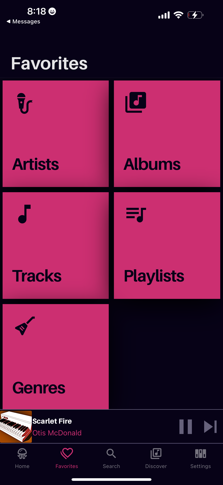
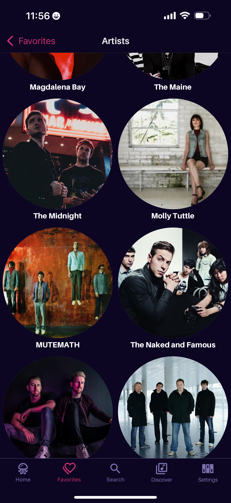

#  Jellify

jellify (verb) - to make gelatinous

*Jellify* is a music player for [Jellyfin](https://jellyfin.org/) built with [React Native](https://reactnative.dev/). It has a  UX meant to feel familiar if you’ve used other music streaming apps.

### Background
I was after a music app for Jellyfin that showcased my music with artwork and had the ability to algorithmically curate music (not that you have to use *Jellify* that way). I also wanted to create a music app that could handle my extremely large music libraries (i.e., 100K+ songs) and not get bogged down. The end goal was to build a music streaming app that worked like the big guys, all while being FOSS and powered by self hosting.

This app was designed with me and my dad in mind, since I wanted to give him a sleek, one stop shop for live recordings of bands he likes (read: the Grateful Dead). The UI was designed so that he'd find it instantly familiar and useful. CarPlay / Android Auto support was also a must for us, as we both use CarPlay religiously. 

**TL;DR** Designed to be lightweight and scalable, *Jellify* caters to those who want a mobile Jellyfin music experience similar to what's provided by the big music streaming services. 

## Features
### Current
- Available via Private Testflight
- iOS and Android support
- Carefully crafted Light and Dark modes
- Home screen access to previously played tracks, artists, and your playlists
- Full Last.FM Plugin support
- Library of Favorited Music, not too dissimilar to how streaming services handle your 'library'
- Full playlist support, including creating, updating, and reordering

### Roadmap
- Quick access to similar artists and items for discovering music in your library
- Support for Jellyfin mixes
- CarPlay / Android Auto Support
- Public Testflight
- Offline Playback
- Web / Desktop support

## Lemme see!
### Home

### Favorites / Library

### Player

## Built with:
### Frontend
[Tamagui](https://tamagui.dev/)\
[React Navigation](https://reactnavigation.org/)\
[React Native Vector Icons](https://github.com/oblador/react-native-vector-icons)
- Specifically Material Community Icons

[React Native CarPlay](https://github.com/birkir/react-native-carplay)\
[React Native Blurhash](https://github.com/mrousavy/react-native-blurhash)

### Backend
[Jellyfin SDK](https://typescript-sdk.jellyfin.org/)\
[Tanstack Query](https://tanstack.com/query/latest/docs/framework/react/react-native)\
[React Native Track Player](https://github.com/doublesymmetry/react-native-track-player)\
[React Native MMKV](https://github.com/mrousavy/react-native-mmkv)\
[React Native File Access](https://github.com/alpha0010/react-native-file-access)

### Love from Wisconsin 🧀
This is undoubtedly a passion project of [mine](https://github.com/anultravioletaurora), and I've learned a lot from working on it (and the many failed attempts before it). I hope you enjoy using it! Feature requests and bug reports are welcome :)

## Special Thanks To
- The [Jellyfin Team](https://jellyfin.org/) for their amazing server software
- Tony, Trevor, and [Jordan](https://github.com/jordanbleu) for their testing and feedback from the early stages of development
- Alyssa, for your artistic abilities and the artwork you made for *Jellify*. It gave it the flair it undoubtedly needed
